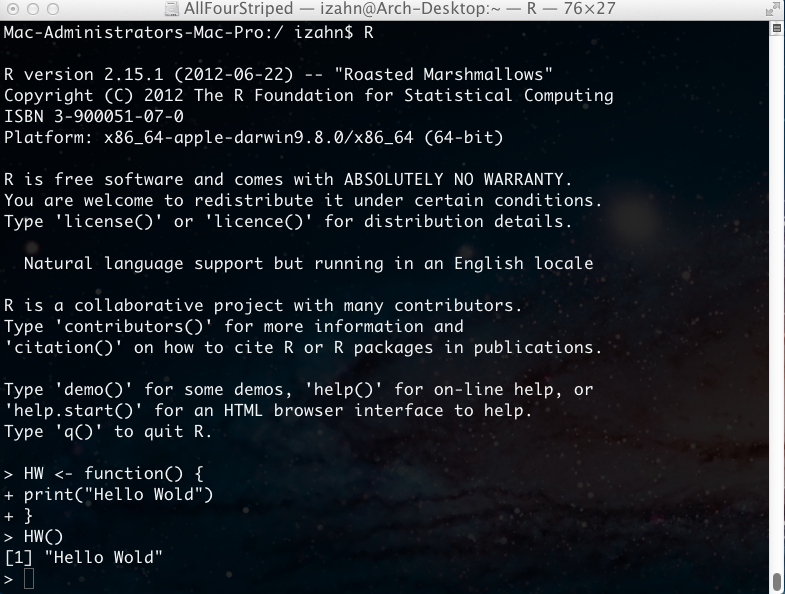
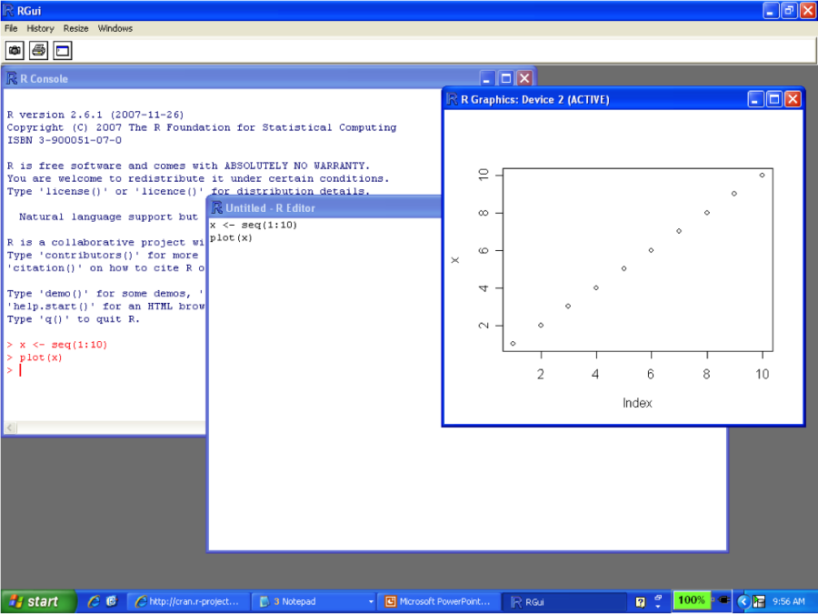
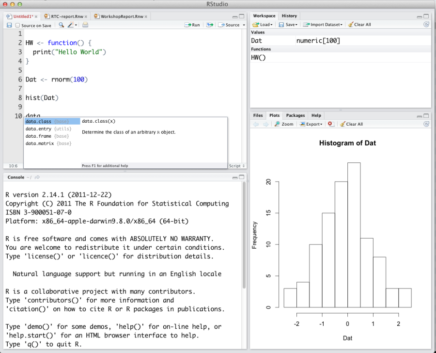
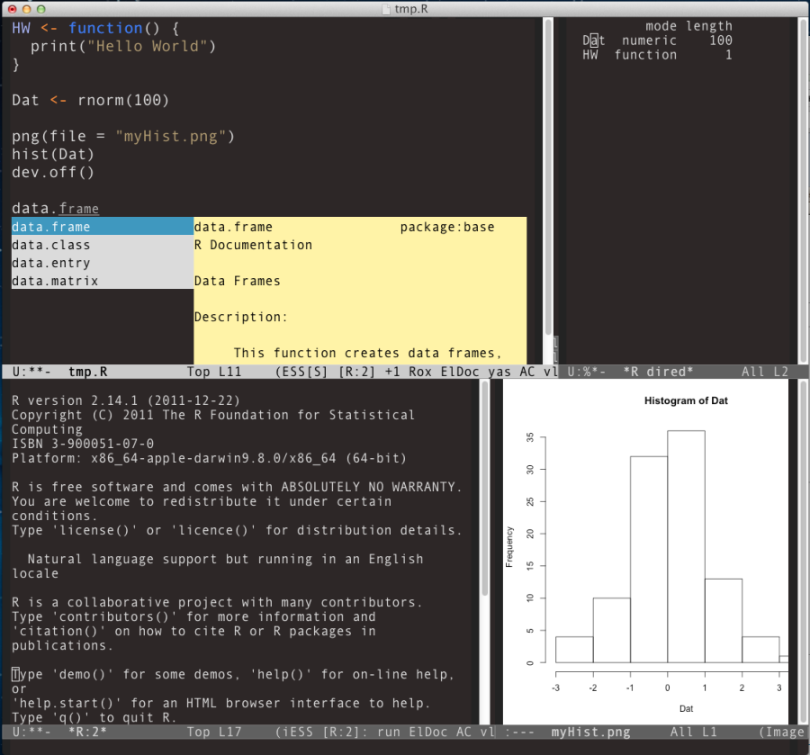
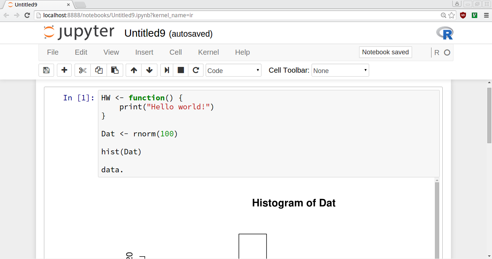
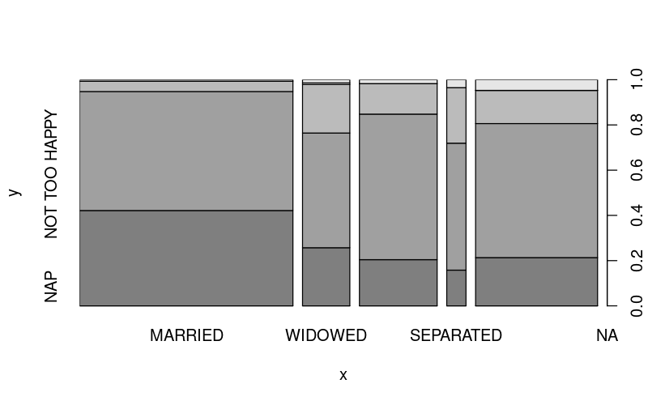

Workshop Materials and Introduction
===================================

Materials and setup
-------------------

You should have R installed --if not:

-   Open a web browser and go to <http://cran.r-project.org> and download and install it
-   Also helpful to install RStudio (download from <http://rstudio.com>)

Download workshop materials:

-   Download materials from <http://tutorials.iq.harvard.edu/R/Rintro.zip>
-   Extract the zip file containing the materials to your desktop

What is R?
----------

R is a *programming language designed for statistical computing*. Notable characteristics include:

-   Vast capabilities, wide range of statistical and graphical techniques
-   Very popular in academia, growing popularity in business: <http://r4stats.com/articles/popularity/>
-   Written primarily by statisticians
-   FREE (no cost, open source)
-   Excellent community support: mailing list, blogs, tutorials
-   Easy to extend by writing new functions

InspiRation
-----------

OK, it's free and popular, but what makes R worth learning? In a word, "packages". If you have a data manipulation, analysis or visualization task, chances are good that there is an R package for that. For example:

-   Want to interactively explore the shape of the Churyumov–Gerasimenko comet?

``` r
  library(rgl)
  open3d()
  comet <- readOBJ(url("http://sci.esa.int/science-e/www/object/doc.cfm?fobjectid=54726"))
  shade3d(comet, col="gray")
  writeWebGL(dir="images", filename = "images/comet.html")
```

-   Want to find out where we are?

``` r
  library(ggmap)
  nwbuilding <- geocode("1737 Cambridge Street Cambridge, MA 02138", source = "google") 
  ggmap(get_map("Cambridge, MA", zoom = 15)) +
    geom_point(data=nwbuilding, size = 7, shape = 13, color = "red")
```

-   Want to forecast the population of Australia?

``` r
  library(forecast)
  fit <- auto.arima(austres)
  ## Projected numbers (in thousands) of Australian residents
  plot(forecast(fit))
```

Whatever you're trying to do, you're probably not the first to try doing it R. Chances are good that someone has already written a package for that.

Coming to R
-----------

Coming from...

Stata  
<http://www.princeton.edu/~otorres/RStata.pdf>

SAS/SPSS  
<http://www.et.bs.ehu.es/~etptupaf/pub/R/RforSAS&SPSSusers.pdf>

matlab  
<http://www.math.umaine.edu/~hiebeler/comp/matlabR.pdf>

Python  
<http://mathesaurus.sourceforge.net/matlab-python-xref.pdf>

Graphical User Interfaces (GUIs)
================================

R GUI alternatives
------------------

The old-school way is to run R directly in a terminal



But hardly anybody does it that way anymore! The Windows versio of R comes with a GUI that looks like this:



The default windows GUI is not very good

-   No parentheses matching or syntax highlighting
-   No work-space browser

RStudio (an alternative GUI for R) is shown below. 

Rstudio has many useful features, including parentheses matching and auto-completion. Rstudio is not the only advanced R interface; other alteratives include Emacs with ESS (shown below).



Emacs + ESS is a very powerful combination, but can be difficult to set up.



Jupyter is a notebook interface that runs in your web browser. A lot of people like it.

Launch RStudio<span class="tag" data-tag-name="labsetup"></span>
----------------------------------------------------------------

-   Open the RStudio program
-   Open up today's R script
    -   In RStudio, Go to **File =&gt; Open Script**
    -   Locate and open the `Rintro.R` script in the Rintro folder on your desktop
-   Go to **Tools =&gt; Set working directory =&gt; To source file location** (more on the working directory later)
-   I encourage you to add your own notes to this file! Every line that starts with `#` is a comment that will be ignored by R. My comments all start with `##`; you can add your own, possibly using `#` or `###` to distinguish your comments from mine.

Exercise 0
----------

The purpose of this exercise is mostly to give you an opportunity to explore the interface provided by RStudio (or whichever GUI you've decided to use). You may not know how to do these things; that's fine! This is an opportunity to learn. If you don't know how to do something you can can use internet search engines, search on [StackOverflow](http:stackoverflow.com), or ask the person next to you.

Also keep in mind that we are living in a golden age of tab completion. If you don't know the name of an R function, try guessing the first two or three letters and pressing TAB. If you guessed correctly the function you are looking for should appear in a pop up!

1.  Try to get R to add 2 plus 2.
2.  Try to calculate the square root of 10.
3.  There is an R package named `car` (Companion to Applied Regression). Try to install this package.
4.  R includes extensive documentation, including a file named "An introduction to R". Try to find this help file.
5.  Go to <http://cran.r-project.org/web/views/> and skim the topic closest to your field/interests.

Data and Functions
==================

Assignment
----------

Values can be assigned names and used in subsequent operations

-   The `<-` operator (less than followed by a dash) is used to save values
-   The name on the left gets the value on the right.

``` r
  x <- 10 # Assign the value 10 to a variable named x
  x + 1 # Add 1 to x
  y <- x + 1 # Assign y the value x + 1
  y
```

Saved variables can be listed, overwritten and deleted

``` r
  ls() # List variables in workspace
  x # Print the value of x
  x <- 100 # Overwrite x. Note that no warning is given!
  x
  rm(x) # Delete x
  ls()
```

Functions
---------

Using R is mostly about applying **functions** to **variables**. Functions

-   take **variable(s)** as input **argument(s)**
-   perform operations
-   **return** values which can be **assigned**
-   optionally perform side-effects such as writing a file to disk or opening a graphics window

The general form for calling R functions is src<sub>R</sub>\[\]{FunctionName(arg.1, arg.2, ... arg.n)}

Arguments can be matched by position or name

Examples:

``` r
  #?sqrt
  a <- sqrt(y) # Call the sqrt function with argument x=y
  round(a, digits = 2) # Call round() with arguments x=x and digits=2
  # Functions can be nested so an alternative is
  round(sqrt(y), digits = 5) # Take sqrt of a and round
```

R packages
==========

There are thousands of R packages that extend R's capabilities.

-   To see what packages are loaded:

src<sub>R</sub>\[\]{search()}

-   To view available packages:

src<sub>R</sub>\[\]{library()}

-   To load a package:

src<sub>R</sub>\[\]{library("car")}

-   Install new package:

src<sub>R</sub>\[\]{install.packages("stringdist")}

Getting data into R
===================

The gss dataset
---------------

The next few examples use a subset of the General Social Survey data set. The variables in this subset include those described below.

``` org
  | var     | description                      |
  |---------+----------------------------------|
  | marital | marital status                   |
  | age     | age of respondent                |
  | educ    | highest year of school completed |
  | sex     | respondents sex                  |
  | inc     | respondents income               |
  | happy   | general happiness                |
  | region  |                                  |
```

The "working directory" and listing files
-----------------------------------------

R knows the directory it was started in, and refers to this as the "working directory". Since our workshop examples are in the Rintro folder on the desktop, we should all take a moment to set that as our working directory:

``` r
  setwd("~/Desktop/Rintro")
```

We can also set the working directory using paths relative to the current working directory:

``` r
  getwd() # get the current working directory
  setwd("dataSets") # set wd to the dataSets folder
  getwd()
  setwd("..") # set wd to enclosing folder ("up")
```

It can be convenient to list files in a directory without leaving R

``` r
  list.files("dataSets") # list files in the dataSets folder
  # list.files("dataSets", pattern = ".csv") # restrict to .csv files  
```

Importing data from files the easy way
--------------------------------------

In order to read data from a file, you usually have to know what kind of file it is. The table below lists some common data types.

| Common data types      |
|------------------------|
| comma separated (.csv) |
| Stata (.dta)           |
| SPSS (.sav)            |
| SAS (.sas7bdat)        |
| Excel (.xls, .xlsx)    |

R is smart enough to recognize most common file formats for us using the `import()` function. To use this functionality we first need to install and attache the `rio` package.

``` r
  ## install and load the rio package
  # install.packages("rio")
  library(rio)
  ## import data from a variety of formats
  # read gss data from the gss.rds R file
  datGSS <- import("dataSets/gss.rds")
  # read gss data from the gss.csv comma separated file
  gss.data <- import("dataSets/gss.csv")
  # read a Stata dataset from gss.dta 
  datGSS <- import("dataSets/gss.dta")
```

Importing data from files the hard way
--------------------------------------

In order to read data from a file, you have to know what kind of file it is. The table below lists the functions needed to import data from common file formats.

| data type                  | function                | package         |
|----------------------------|-------------------------|-----------------|
| comma separated (.csv)     | read.csv()              | utils (default) |
| other delimited formats    | read.table()            | utils (default) |
| Stata version 7-12 (.dta)  | read.dta()              | foreign         |
| Stata version 13-14 (.dta) | read<sub>dta</sub>()    | haven           |
| SPSS (.sav)                | read.spss()             | foreign         |
| SAS (.sas7bdat)            | read.sas7bdat()         | sas7bdat        |
| Excel (.xls, .xlsx)        | readWorksheetFromFile() | XLConnect       |

Examples:

``` r
  # read gss data from the gss.rds R file
  datGSS <- readRDS("dataSets/gss.rds")
  # read gss data from the gss.csv comma separated file
  gss.data <- read.csv("dataSets/gss.csv") # read gss data
  # read a Stata dataset from gss.dta 
  library(foreign) # load foreign data functions
  datGSS <- read.dta(file="dataSets/gss.dta")
```

Checking imported data
----------------------

Always a good idea to examine the imported data set--usually we want the results to be a `data.frame`

``` r
  class(datGSS) # check to see that test is what we expect it to be
  dim(datGSS) # how many rows and columns?
  names(datGSS) # or colnames(datGSS)
  str(datGSS[1:10]) # more details about the first 10 columns
```

Saving and loading R workspaces
-------------------------------

In addition to importing individual datasets, R can save and load entire workspaces

-   Save our entire workspace

``` r
  ls() # list objects in our workspace
  save.image(file="myWorkspace.RData") # save workspace 
  rm(list=ls()) # remove all objects from our workspace 
  ls() # list stored objects to make sure they are deleted
```

-   Load the "myWorkspace.RData" file and check that it is restored

``` r
  load("myWorkspace.RData") # load myWorkspace.RData
  ls() # list objects
```

When you close R you will be asked if you want to save your workspace -- if you choose yes then your workspace will be restored next time you start R

Exercise 1
----------

1.  Install and attach the `rio` package if you haven't already done so

2.  Read the SPSS data set in dataSets/gss.sav and assign the result to an R data object named GSS.sav

3.  Make sure that the data loaded in step 2 is a data.frame

4.  Display the dimensions of the GSS.sav

5.  BONUS: figure out how to read the Excel file "gss.xlsx" into R

Asking R for help
=================

R has extensive built-in documentation that can be accessed through R commands or through the GUI.

-   Start html help, search/browse using web browser
    -   at the R console:

src<sub>R</sub>\[\]{help.start()}

-   or use the help menu from you GUI
-   Look up the documentation for a function

src<sub>R</sub>\[\]{help(plot)} src<sub>R</sub>\[\]{?kmeans}

-   Look up documentation for a package

src<sub>R</sub>\[\]{help(package="stats")}

-   Search documentation from R (not always the best way... google often works better)

src<sub>R</sub>\[\]{help.search("classification")}

Data Manipulation
=================

data.frame objects
------------------

-   Usually data read into R will be stored as a **data.frame**

-   A data.frame is a list of vectors of equal length
    -   Each vector in the list forms a column
    -   Each column can be a differnt type of vector
    -   Often the columns are variables and the rows are observations
-   A data.frame has two dimensions corresponding the number of rows and the number of columns (in that order)

Extracting subsets of data.frames
---------------------------------

You can extract subsets of data.frames using the `subset()` function[1]. Use the `select` argument to select columns:

``` r
  # selecting specifig columns
  head(# first n rows
       subset(datGSS,            
              select = 1:4 # column 1 to 5
              ),
       n = 10# show first 10 rows
       )
```

and the `subset` argument to select rows:

``` r
  subset(datGSS,
         # rows where age > 90
         subset = age > 90,
         ## sex and age columns
         select = c("sex", "age"))

  ## the $ operator can be used to extract a single column
  str(datGSS$age)
```

In the previous example we used `>` to select rows where age was greater than 90. Other relational and logical operators are listed below.

| Operator | Meaning                  |
|----------|--------------------------|
| ==       | equal to                 |
| !=       | not equal to             |
| &gt;     | greater than             |
| &gt;=    | greater than or equal to |
| &lt;     | less than                |
| &lt;=    | less than or equal to    |
| &        | and                      |
| |        | or                       |

Transforming data.frames
------------------------

You can modify data.frames using the `transform()` function.

``` r
  # creating new variable mean centered age
  datGSS <- transform(datGSS,
                      ageC = age - mean(age))

   #education difference between wifes and husbands
  datGSS <- transform(datGSS,
                      educ.diff = wifeduc - husbeduc)

  datGSS$wifeduc_comp <- ifelse(
                           is.na(datGSS$wifeduc), #condition
                           mean(datGSS$wifeduc, na.rm=TRUE), # value if condition met
                           datGSS$wifeduc) # value otherwise

    ## examine our newly created variables
  head(subset(datGSS,
              select = c("age", "ageC", "wifeduc", "wifeduc_comp",
                         "husbeduc", "educ.diff")), n = 8)
```

Note that `transform` is a convenience function; see `?Extract` for a more powerful way to modify data.frames.

Exporting Data
--------------

Now that we have made some changes to our GSS data set, we might want to save those changes to a file. Everything we have done so far has only modified the data in R; the files have remained unchanged.

``` r
  # write data to a .csv file
  write.csv(datGSS, file = "gss.csv")
  # write data to a Stata file
  write.dta(datGSS, file = "gss.dta")
  # write data to an R file
  saveRDS(datGSS, file = "gss.rds")
```

Exercise 2: Data manipulation
-----------------------------

Use the gss.rds data set

1.  Generate the following variables:
    -   "rich" equal to 0 if rincdol is less than 100000, and 1 otherwise
    -   "sinc" equal to incomdol - rincdol

2.  Create a subset of the data containing only rows where "usecomp" = "Yes"
3.  Examine the data.frame created in step 2, and answer the following questions:
    -   How many rows does it have?
    -   How many columns does it have?
    -   What is the class of the "satjob" variable?

4.  BONUS (hard): Generate a variable named "dual.earn" equal to 1 if both wkftwife = 1 and wkfthusb = 1, and zero otherwise

Basic Statistics and Graphs
===========================

Basic statistics
----------------

Descriptive statistics of single variables are straightforward:

``` r
  mean(datGSS$educ) # calculate mean value of education
  sd(datGSS$educ) # calculate standard deviation of x
  # calculate min, max, quantiles, mean of educ, age, and ageC
  summary(subset(datGSS, select = c("educ", "age", "ageC")))
```

Some of these functions (e.g., summary) will also work with data.frames and other types of objects, others (such as `sd`) will not.

Counts and proportions
----------------------

Start by using the `table()` function to tabulate counts, then perform additional computations if needed

``` r
  sex.counts <- table(datGSS$sex) # tabulate sex categories
  sex.counts
  prop.table(sex.counts) # convert to proportions
```

Add variables for crosstabs

``` r
  table(subset(datGSS, select = c("sex", "happy"))) # crosstab marital X happy
```

Statistics by classification factors
------------------------------------

The `by()` function can be used to perform a calculation separately for each level of a classifying variable

``` r
  by(subset(datGSS, select = c("income", "educ")),
     INDICES=datGSS["sex"],
     FUN=summary)
```

Correlations
------------

Let's look at correlations among between age, income, and education

``` r
  cor(subset(datGSS, select =  c("age", "incomdol", "educ")))
```

For significance tests, use cor.test()

``` r
  with(datGSS,
       cor.test(age, educ))
```

Multiple regression
-------------------

Modeling functions generally use the *formula* interface whith DV on left followed by "~" followed by predictors--for details see src<sub>R</sub>\[\]{help("formula")}

-   Predict the number of hours individuals spend on email (emailhrs)

``` r
  m1 <- lm(educ ~ sex + age, data = datGSS)
  summary(m1)
```

Save R output to a file
-----------------------

Earlier we learned how to write a data set to a file. But what if we want to write something that isn't in a nice rectangular format, like the results of our regression model? For that we can use the `sink()` function:

``` r
  sink(file="output.txt", split=TRUE) # start logging
  print("This is the result from model 1\n")
  print(summary(m1))
  sink() ## sink with no arguments turns logging off
```

Basic graphics: Frequency bars
------------------------------

Thanks to classes and methods, you can `plot()` many kinds of objects:

``` r
  plot(datGSS$marital) # Plot a factor
```


Basic graphics: Boxplots by group
---------------------------------

Thanks to classes and methods, you can `plot()` many kinds of objects:

``` r
  with(datGSS,
       plot(marital, educ)) # Plot ordinal by numeric
```


Basic graphics: Mosaic chart
----------------------------

Thanks to classes and methods, you can `plot()` many kinds of objects:

``` r
  with(datGSS, # Plot factor X factor
       plot(marital, happy))
```



Exercise 3
----------

Using the datGSS data.frame

1.  Cross-tabulate sex and emailhrs
2.  Calculate the mean and standard deviation of incomdol by sex
3.  Save the results of the previous two calculations to a file
4.  Create a scatter plot with educ on the x-axis and incomdol on the y-axis

Wrap-up
=======

Help us make this workshop better!
----------------------------------

-   Please take a moment to fill out a very short feedback form
-   These workshops exist for you – tell us what you need!
-   <http://tinyurl.com/R-intro-feedback>

Additional resources
--------------------

-   IQSS workshops: <http://projects.iq.harvard.edu/rtc/filter_by/workshops>
-   IQSS statistical consulting: <http://dss.iq.harvard.edu>
-   Software (all free!):
    -   R and R package download: <http://cran.r-project.org>
    -   Rstudio download: <http://rstudio.org>
    -   ESS (emacs R package): <http://ess.r-project.org/>
-   Online tutorials
    -   <http://www.codeschool.com/courses/try-r>
    -   <http://www.datamind.org>
-   Getting help:
    -   Documentation and tutorials: <http://cran.r-project.org/other-docs.html>
    -   Recommended R packages by topic: <http://cran.r-project.org/web/views/>
    -   Mailing list: <https://stat.ethz.ch/mailman/listinfo/r-help>
    -   StackOverflow: <http://stackoverflow.com/questions/tagged/r>

Exercise solutions
==================

Exercise 0 solution<span class="tag" data-tag-name="prototype"></span>
----------------------------------------------------------------------

1.  \[@1\] \] Try to get R to add 2 plus 2.

``` r
  2 + 2
```

1.  \[@2\] Try to figure out how evaluate lines directly from your R script.

=In Rstudo this is 'Control-Enter'; may be different in another GUI=

1.  \[@3\] R includes extensive documentation, including a file named "An introduction to R". Try to find this help file.

=Go to the main help page by running 'help.start() or using the GUI menu, find and click on the link to "An Introduction to R".=

1.  \[@4\] Go to <http://cran.r-project.org/web/views/> and skim the topic closest to your field/interests.

=I like the machine learning topic=

Exercise 1 solution<span class="tag" data-tag-name="prototype"></span>
----------------------------------------------------------------------

1.  \[@1\] Attach the `rio` package if you haven't already done so

``` r
  ## install.packages("rio")
  library(rio)
```

1.  \[@2\] Read the SPSS data set in dataSets/gss.sav and assign the result to an R data object named GSS.sav

``` r
  gss.data <- import("dataSets/gss.sav")
```

1.  \[@3\] Make sure that the data loaded in step 2 is a data.frame (hint: check the arguments documented in the help page)

``` r
  class(gss.data)
```

1.  \[@4\] Display the dimensions of the GSS.sav.

``` r
  dim(gss.data)
  nrow(gss.data)
  ncol(gss.data)
```

1.  \[@6\] BONUS: figure out how to read the Excel file "gss.xlsx" into R

``` r
  dat <- import("dataSets/gss.xlsx")
  class(dat); dim(dat)
```

Exercise 2 solution<span class="tag" data-tag-name="prototype"></span>
----------------------------------------------------------------------

Use the gss.rds data set

``` r
  gss <- import("dataSets/gss.rds")
```

1.  \[@1\] Create a subset of the data containing only rows where "usecomp" = "Yes". How many computer users are there?

``` r
  gss.usecomp <- subset(gss, usecomp == "Yes")
  nrow(gss.usecomp)
```

1.  \[@2\] Generate the following variables:
    -   "rich" equal to 0 if rincdol is less than 100000, and 1 otherwise
    -   "sinc" equal to incomdol - rincdol

``` r
  gss <- transform(gss,
                   rich = ifelse(rincdol < 100000, 0, 1),
                   sinc = incomdol - rincdol)
  head(subset(gss, select = c("rincdol", "incomdol", "rich", "sinc")))
```

1.  \[@3\] Generate a variable named "dual.earn" equal to 1 if both wkftwife = 1 and wkfthusb = 1, and zero otherwise. How many dual earners are there?

``` r
  gss$dual.earn <- ifelse(gss$wkftwife == 1 & gss$wkfthusb == 1, 1, 0)
  nrow(subset(gss, dual.earn == 1))
```

Exercise 3 solution<span class="tag" data-tag-name="prototype"></span>
----------------------------------------------------------------------

Using the datGSS data.frame

1.  \[@1\] Cross-tabulate sex and emailhrs

``` r
  with(datGSS, table(emailhrs, sex))
```

1.  \[@2\] Calculate the mean and standard deviation of incomdol by sex

``` r
  by(datGSS$incomdol, datGSS$sex, mean)
  by(datGSS$incomdol, datGSS$sex, sd)
```

1.  \[@3\] Create a scatter plot with educ on the x-axis and incomdol on the y-axis

``` r
  plot(subset(datGSS, select = c("educ", "incomdol")))
```

`That first attempt is pretty ugly, let's clean it up.`

``` r
  plot(log(incomdol) ~ jitter(educ, 8), # formula interface with log an jitter
       data = subset(datGSS, # subsetting data as part of the plot call
                     subset = educ < 97),
       cex = .6 # make points smaller
       )
```

[1] Note that `subset()` is a convenience function; see `?Extract` for a more powerful (and complicated) way to subset data.
